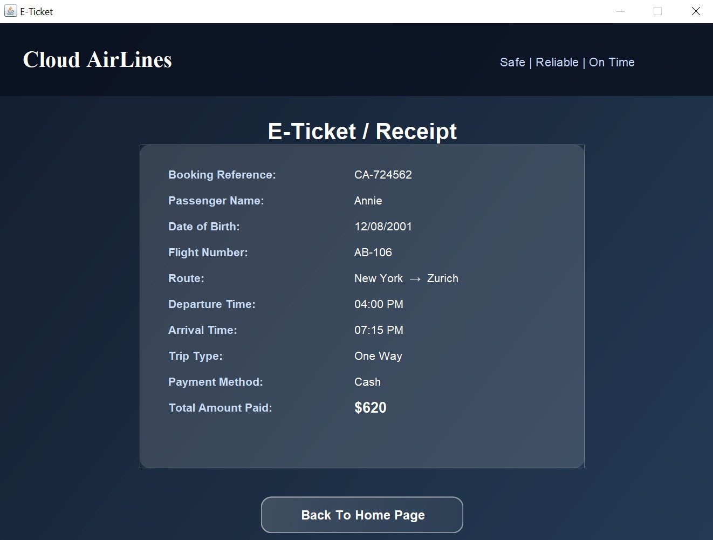

# ✈️ Cloud AirLines — Flight Booking System

A desktop flight booking application built with **Java Swing**, following **Object-Oriented Programming (OOP)** principles. Cloud AirLines lets users create an account, search for flights between cities, book a seat with cash or card payment, and view a detailed e-ticket/receipt after booking.

---

## 📋 Features

- **User Authentication** — Sign up and log in with a username/password.
- **Flight Search** — Select departure and arrival cities, and choose one-way or round-trip.
- **Available Flights Listing** — View matching flights with flight number, route, timings, and price.
- **Passenger Details Form** — Enter passenger name and date of birth, with input validation (including real calendar date validation for DOB).
- **Two Payment Methods**:
  - **Cash** — instant booking confirmation.
  - **Card** — dedicated card payment form with basic validation (card number length, CVV format, required fields).
- **Booking Confirmation** — Success page with the option to cancel the booking.
- **E-Ticket / Receipt** — A detailed receipt showing booking reference, passenger info, flight details, trip type, payment method, and total amount paid (correctly calculated for round trips).
- **Back Navigation** — Every page includes a Back option, so users can review or correct earlier steps without losing their progress (e.g. going back from Card Payment keeps passenger details filled in).
- **Custom UI Theme** — Gradient backgrounds, glassmorphism-style cards, and glowing hover buttons for a modern look, built entirely with custom Swing components (no external UI libraries).

---

## 🛠️ Tech Stack

- **Language:** Java
- **GUI Framework:** Java Swing (AWT + Swing components)
- **Design Pattern:** Object-Oriented Programming — separate `frontend` (UI/pages) and `backend` (data models & logic) packages
- **Data Storage:** In-memory (no database) — bookings and flights are held in memory during runtime

---

## 📂 Project Structure

```
src/
├── frontend/
│   ├── LoginPage.java
│   ├── createaccount.java
│   ├── FlightsPage.java
│   ├── FlightDetailPage.java
│   ├── BookingForm.java
│   ├── CardPaymentForm.java
│   ├── SuccessPage.java
│   ├── ReceiptPage.java
│   └── UItheme.java
└── backend/
    ├── signupinfo.java
    ├── Flight.java
    ├── FlightsData.java
    ├── FlightSearch.java
    ├── Booking.java
    ├── BookingManager.java
    └── PaymentManager.java
```

---

## 🚀 How to Run

1. Clone this repository:
   ```bash
   git clone https://github.com/yourusername/cloud-airlines-booking-system.git
   ```
2. Open the project in your preferred Java IDE (IntelliJ IDEA, Eclipse, VS Code with Java extensions, etc.).
3. Make sure the `frontend` and `backend` folders are correctly recognized as packages under `src`.
4. Run `LoginPage.java` — this is the application's entry point.

> **Requirements:** Java JDK 8 or higher.

---

## 📸 Screenshots

| Sign In | Sign Up |
|---|---|
|  |  |

| Select Cities | Cities Confirmed |
|---|---|
|  |  |

| Available Flights | Passenger Details |
|---|---|
|  |  |

| Booking Successful | E-Ticket / Receipt |
|---|---|
|  |  |

## 💡 Future Improvements

- Persist bookings and accounts to a file or database instead of in-memory storage
- Multiple passenger booking in a single transaction
- Seat selection
- Email confirmation simulation
- Search filters (price range, time of day)

---

## 👤 Author

Built by **[Your Name]** as a personal Java OOP practice project.